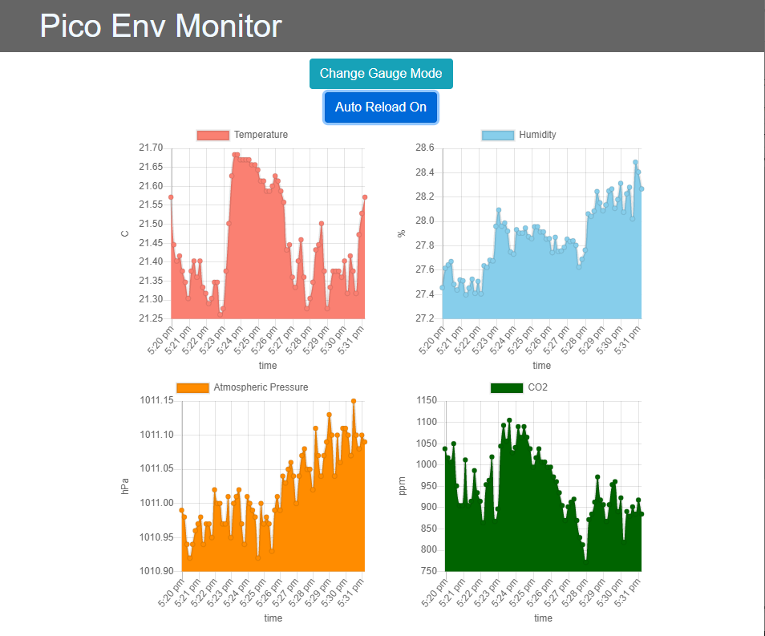
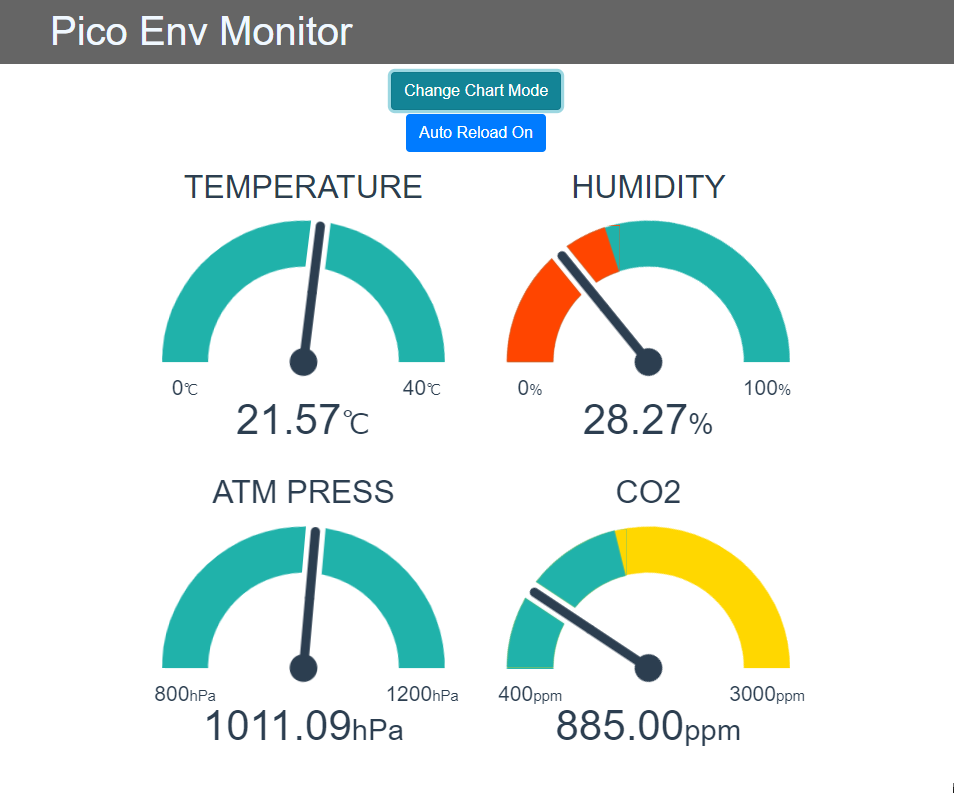

# pico_env_monitor
Temperature, humidity, atmospheric pressure, and CO2 monitor using Raspberry Pi Pico.

sensor: SHT35, BME280, CCS811

ラズベリーパイPicoで温湿度、大気圧、CO2を計測＆Vue.jsで表示

家や職場の換気の目安に...

<br>

## こんな感じ



<br>

## 使い方
1. ラズベリーパイPicoで`pico/env_monitor.py`を実行。
    - BME280はmicropython-bme280をインストール [参考1](https://www.itmedia.co.jp/news/articles/2107/23/news022.html)
    - CCS811は[参考2](https://gist.github.com/74th/90ba450bac528bab4a7f46960c88976f)より
    - センサ部分は用意出来たもの次第

1. ホストPCで`host_logger/read_pico.py`を実行
    - OSによってserialの部分を変える
    - `env_monitor.py`と`read_pico.py`はThonnyで両方同時に実行するのが良さそう

1. ホストPCでwebサーバなどを用意し、`host_front/pico-env-monitor/dist`の中身を表示
    - 確認するだけなら、↓など
        ```sh
        npm install -g serve
        serve -s dist
        ```
    - タスクスケジューラ(Windows)やcrontab(UNIX/Linux)などでログの名前を変更出来るようにする。例：`rename.cmd`(Windos用)
    - Auto ReloadをON(ボタンが赤になっている状態)にしておくと、自動で値が更新される

<br>

## 開発技術
- IoT: Raspberry Pi Pico, I2Cセンサ
- python
- Web: Vue.js, Bootstrap-Vue, Chart.js

<br>

## こだわり
- 多くの人が分かりやすいよう、シンプルな表示に
- 人が密集しないよう、各自で見られるWebに

<br>

## きっかけ
- 研究室の二酸化炭素計が壊れる
- 研究室で購入したラズベリーパイPicoが余っていた